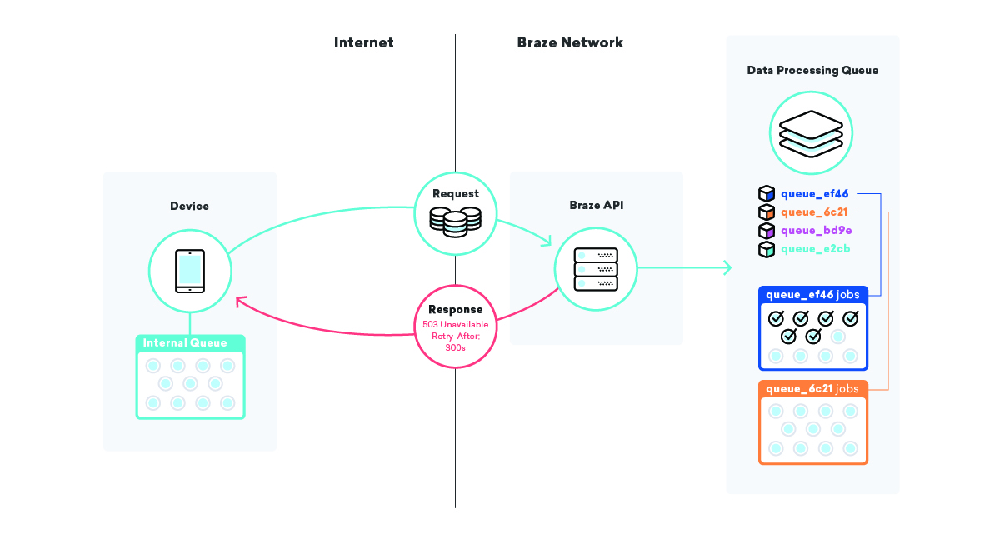

Title: Achieving Resiliency With Queues: Building A System That Never Skips A Beat In A Billion
Date: 2018-12-20
Category: Software Development
Tags: software architecture, job queues, design patterns, architecture patterns
Authors: Zach McCormick

Braze processes billions and billions of events per day on behalf of its customers, resulting in billions
of hyper-focused, personalized messages—but failing to send one of those messages has consequences. To make
sure those key messages are always correct and always on time, Braze takes a strategic approach to how we
leverage job queues.

## What’s a Job Queue?

A typical job queue is an architectural pattern where processes submit computation jobs to a queue and
other processes actually execute the jobs. This is usually a good thing—when used properly, it gives you
degrees of concurrency, scalability, and redundancy that you can’t get with a traditional request–response
paradigm. Many workers can be executing different jobs simultaneously in multiple processes, multiple
machines, or even multiple data centers for peak concurrency. You can assign certain worker nodes to work
on certain queues and send particular jobs to specific queues, allowing you to scale resources as needed.
If a worker process crashes or a data center goes offline, other workers can execute the remaining jobs.

While you can certainly apply these principles and run a job-queueing system easily at a small scale, the
seams start to show (and even burst) when you’re processing billions and billions of jobs. Let’s take a
look at a few problems Braze has faced as we’ve grown from processing thousands, to millions, and now
billions of jobs per day.

Check out the rest of this blog post at [Building Braze](https://www.braze.com/perspectives/article/building-braze-job-queues-resiliency)!

<!-- COMMENTED OUT TO DRIVE TRAFFIC TO BRAZE
## Lack of Consistency Is a Weakness

What happens if we send a message, but we crash before recording the fact that we just sent that message?

A couple different bad outcomes are possible here. First, you might reschedule the failed job and send the message again. That’s…not ideal: no one wants to receive the same thing twice. Instead, consider not rescheduling it at all. In that case, our internal accounting will be incorrect, so attributions, conversions, and all kinds of other things won’t be right moving forward.

How do we fix that? When writing our job definitions, we think really hard about idempotency and retry behavior.

When you’re talking about queues, idempotency means that a single job can be terminated at an arbitrary point, the re-queued job reran in its entirety, and the end result will be the same as if we had successfully run the job exactly one time. This is intimately tied to our retry behavior of choice—at-least-once delivery. By keeping in mind that all of our jobs will be run at least once, and maybe multiple times, we can write idempotent job definitions that ensure consistency even in the face of random failures.

Going back to our message-sending example, how might we use these concepts to ensure consistency? In this case, we might break the job into two pieces, with the first one sending the message and enqueuing the second one, and the second one writing to the database. In that scenario, we can retry either job as many times as we want—if the message-sending provider is down, or the internal accounting database is down, we’ll appropriately retry until we succeed!

## Good Fences Make Good Neighbors

What happens to our example company Consolidated Widgets’ data processing when the database for Global Gizmos is down?

In this scenario, if our at-least-once delivery strategy is in play, we would expect all of the data-processing jobs for Global Gizmos to retry over and over until they succeed. This is great—we won’t lose any data even while their database is down. For Consolidated Widgets, however, it may not be that great: if the workers are constantly retrying and failing, they might be too busy to process Consolidated Widgets’ work in a timely fashion.

We can fix this by using well-chosen queue names and pausing certain queues as needed. With this in our toolbelt, we can relieve the strain on pieces of infrastructure in a surgical manner. In our scenario above, once we know that Global Gizmos’ database is down, we can pause their data processing queue until we know it’s back up, ensuring that one specific outage doesn’t impact any other customers!

## Waiting Is Painful

What if Consolidated Widgets and Global Gizmos send email campaigns to 50 million users each, 5 minutes apart? Who goes first?

Simple job-queuing systems have a simple "work" queue that workers pull jobs from. Once you have a nice variety of different jobs and job types, you probably move on to having multiple types of queues, each having different priorities or types of workers pulling from those queues. In that vein, we have a variety of simple queues for data processing, messaging, and various maintenance tasks.

Fast-forward to when you're sending billions of personalized messages per day, one "messaging" queue isn't going to cut it—what happens when that queue grows extremely large, like in our example above? Do we prioritize the jobs that arrived first?

Our dynamic queueing system seeks to address a phenomenon called job starvation, where a job that is ready to execute waits for a long time before executing, usually because of some kind of priority. In a simple "messaging" queue, the priority is simply the time the job entered the queue, meaning that jobs added to the end of a big queue can end up waiting for a very long time.

When we go to queue up a campaign and all of its messages, instead of adding the jobs to a big "messaging" queue, we create a totally new queue for just this campaign, complete with a special name so we know what it is and how to find it. After adding the jobs to the queue, we grab our “dynamic queues” list and add this new queue name to the end.

By employing this strategy, we can instruct workers to pick up the name of a dynamic queue from the “dynamic queues” list, then process all of the jobs on that particular queue. This lets us ensure that messages are being sent as fast as possible AND that all of our customers are being treated with equal priority.

Consequently, this has other benefits, like higher cache hit rates and fewer database connections, because of the increase in work locality for particular workers. Everybody wins!

## Always Have a Backup Plan

What happens when a database is down, some queues are paused, and the job queues start to fill up?

Sometimes important pieces of infrastructure simply die on you. We have secondaries and backups in place, but the time it takes to promote backup infrastructure is almost never zero. Having multiple layers of queues across the entire application infrastructure can be very helpful in mitigating the impact of these types of events.

One such strategy we employ is queueing on devices themselves. Millions and millions of devices have different applications using a Braze SDK, and in those applications, we utilize a queue for sending data to our APIs.

When our SDK goes to submit that data and fails, for whatever reason, the SDK queues up a retry using an exponential backoff algorithm until it succeeds. This strategy minimizes the impact of infrastructure or code failures, since devices will simply queue up their own data and send it to Braze when everything is back online.

## Moving Fast and Not Breaking Things

At the end of the day, our goal is to send hyper-focused, personalized messages better than anyone else, and that involves moving quickly, being resilient, and getting everything right. Job queues are at the heart of Braze’s infrastructure, so we’re always watching our performance, employing best practices, and experimenting with new strategies and advanced techniques to be the best in the game.

If this type of high-performance, low-latency systems engineering in the marketing automation space excites you, then you should definitely check our job board!
-->
