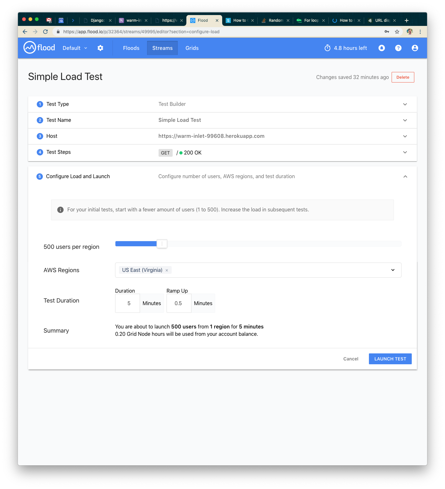

Title: Connected Content And The Slashdot Effect (Or How I Learned To Scale APIs)
Date: 2019-6-20
Category: Software Development
Tags: software architecture, api design, design patterns, architecture patterns
Authors: Zach McCormick

One of the coolest ways our customers integrate with our product is through a feature we call Connected
Content. By utilizing custom HTTP endpoints—either owned by the customer or via one of their partners—our 
customers can inject customized, on-demand content into messages right before they’re sent. Customers use
this for a huge variety of use cases, such as personalized recommendations, weather information, and
automated language translations. One of the common hiccups, however, is that these endpoints must be able
to absorb huge spikes in traffic in order for Braze to send messages quickly.

In the early 2000s, the phenomenon of a web service being unavailable due to large traffic spikes was known
as the Slashdot Effect. Sites linked by popular articles on Slashdot would see huge amounts of traffic very
quickly and almost immediately become unusable—this was just how it was before the days of cheap,
easy-to-deploy auto-scaling and load-balancing services. Even today, this problem persists, and with
regards to Connected Content, we’ve come to see a similar “Braze Effect,” where endpoints originally
designed for lower-volume, consistent traffic are hit with a large traffic spike to inject Connected
Content into messages due to Braze’s sending speed.

Building something capable of absorbing massive but infrequent traffic spikes can be tricky. All kinds
of strategies can be taken around application server tuning, tactical database choices, and judicious
load testing in order to build something to fit that profile, even at a relatively low cost.

Check out the rest of this blog post at [Building Braze](https://www.braze.com/perspectives/article/building-braze-job-queues-resiliency)!

<!-- COMMENTED OUT TO DRIVE TRAFFIC TO BRAZE

In this post, we’ll dive deeper into this using my favorite framework for building simple web services: Django. It supports multiple databases, cache backends, queueing systems, etc. out of the box. We’ll walk through a step-by-step process of using Django to develop and iterate on a high-performance API capable of absorbing huge traffic spikes. We’ll use Heroku for hosting our service and flood.io for load testing it.

I’m providing instructions on how to do this on recent versions of MacOS using Homebrew, a command line package manager, but feel free to adjust for your platform of choice.

## Installation and Initialization

To get started, you'll need Postgres and Redis installed.

Then, clone the example repository and checkout the first step.

Once you’ve cloned the example repository, you’ll want to install the requirements and boot up the server.

That should get you running locally so you can test that your endpoint works. To get started with Heroku via the CLI tool, create a new application and push your code to it via git.

Once you’re set up on Heroku, you should see something like the following when you visit your new application:

Go into the Heroku dashboard for your application and you’ll see a screen such as the following:

Click on “Configure Dynos” and go ahead and select the 1x Standard Dyno for our default choice. That should be powerful enough for our testing use case right now.

Once you’ve done that, you’ll want to modify your Heroku Postgres instance as well. We’ll go ahead and use the Standard-0 size instance. It should allow enough connections and be fast enough not to limit our response time too much.

You’ll have two instances of Heroku Postgres for a while. You’ll need to promote the new instance to the default one using a command similar to the one below (note: HEROKU_POSTGRESQL_IVORY may not be the environment variable/name for your particular instance).

Once you’ve migrated over to the larger database instance, you can delete the old, smaller one. When you’re done, your dashboard should look something like this.

Lastly, we want to turn off debug mode, so go ahead and set the DJANGO_DEBUG environment variable to false.

## Our First Test: A Basic Setup

I enjoy using flood.io for load testing—it’s relatively simple to generate huge amounts of load with relatively little configuration. Our first test will be hitting our endpoint with 500 users for five minutes. You’ll want to configure your test to look something like the screenshot below. Note: you may need to purchase credits on flood.io for some of these more intensive tests.

Next, launch your test!

While your grid is booting and your tests are about to spin up, go back to the Heroku dashboard so we can see what’s going on from your application’s point of view.

We’ll alternate between flood.io and your application’s metrics dashboard. Here is approximately what it should look like when your test finishes.

We never set up a page, so everything was a 400 error. Average response time of about 600ms, max of about 4 seconds. What next?

Let's make a database model, generate some fake data, then make a page that renders something from the database. To save some time, simply check out and push the next step in the example project.

From here, take the following steps locally to confirm it all works.

Visit http://127.0.0.1:8000/ and confirm you get a 140-character string returned to you. That’s our “data” to simulate something you might want your Connected Content endpoint to return for each user.

On Heroku’s end, we need to generate the seed data as well. To do that, use the Run Console option and run the following command.

Visit your application and confirm it works the same as it does locally.

## Our Second Test: Serving Real Data

For this test, we’ll use the same size flood.

Once you launch the test, you’ll see different (better) results!

On the Heroku side of things, we can see that we’re successfully serving the requests now. Fantastic!

We set up a page now, so we should be getting all 200s this time. Our average response time was about 47ms, max around 150ms—great! We're probably hitting the table cache every time in the database, so we have some options for pushing our system:

- We could add more concurrent requests
- We could add way more seed data so that everything isn't cached in the database

Let's add more requests!

## Our Third Test: 10x User Count

This time we’ll use 5,000 users to simulate 10x the load.

This time we had five minutes of about 9k requests per minute with an average response of 14 seconds. We also started to see some failed requests. That’s not great, so let’s think about how we can scale our system a little bit better. We have a couple ways we could scale out now:

- We could add additional dynos
- We could change our server application

We're going to use the second option.

Note: gunicorn, with naive settings, is going to use a pool of workers and doesn't handle concurrent requests very well. Let's install gevent and tell our server process to use greenlets instead of synchronous workers.

Instead of doing that yourself, you can just check out the next step and deploy to Heroku.

Visit your application and confirm it still works.

## Our Fourth Test: Tuning the Application Server

Wow, what happened? We tried the same 5000 users but our application just couldn’t keep up! The error rate is almost 90%. Something is wrong. Let’s check the Heroku logs.

I’ll explain what this means to save you some Googling! A caveat of using asynchronous workers on gunicorn is that each one is going to open its own connection to the database. In our logs, we can see that we're throwing exceptions because there are too many connections.

Looking at the Postgres metrics page in the Heroku dashboard, we can see that we opened FAR more connections than the first time (we were using single-digit connections the first time).

Let's try something else. Waitress is a pure-Python WSGI server that will buffer requests to a fixed pool of workers, but still handle incoming HTTP connections in an asynchronous way. Let's install that, and change our Procfile accordingly. As per usual, you can just check out that step.

As always, visit your application to confirm it works.

Note: you may need to restart your dynos before deploying to free up database connections.

## Our Fifth Test: A Better Application Server

This time we were easily able to handle 5000 concurrent users over five minutes with a 0% error rate and 178ms average response time. AWESOME! Let's add more concurrent requests—we weren't taxing this at all!

## Our Sixth Test: 2x More Users

With 10k concurrent users over five minutes, we were serving about 108k requests. We probably hit peak concurrency in this range: errors went up and response time spiked to about nine seconds on average.

Let's try scaling up by adding an additional dyno.

## Our Seventh Test: Double the Dynos

This time we also used 10k concurrent users but were able to serve closer to 180k requests. Our response time went back down to 215ms on average. Great! Let's try increasing the load just a little bit more.

## Our Eighth Test: 15k Users

This time with 15k concurrent users over five minutes we served about 150k requests and response time went up to 11s. Somewhere in there we've hit peak concurrency again. This next time, though, we'll try a new strategy—let's not hit the database, but let's hit Redis instead. Redis is an in-memory key-value store, so we have to store our data a little bit differently than we might if we were using a relational database. With a relational database, we’d probably be joining normalized tables together to put together everything we need. With Redis, we need to change how we think about storage.

Check out the next step from git and look at the new code.

To test this locally, you’ll want to run the following to seed our Redis instance with data.

Visit your application locally, confirm it works, then replicate this on Heroku via the Run Console again. You’ll need to add a Redis instance to your application. I used Premium-0 since it can handle the number of incoming connections our two dynos need.

## Our Ninth Test: Redis over Postgres

With 10k concurrent users again (we stepped down to compare fairly against our seventh test), we can see our application handled about 190k requests over five minutes, and response time went down to 34ms. WOW! Let's see if we can handle the 15k users with Redis!

## Our Final Test: Redis with 15k Users

With 15k concurrent users over five minutes, we were able to serve 255k requests. Response time went back up, but only to 1.4s, and we still had very few failed requests.

At this point, by looking at the Heroku metrics page, we're probably hitting peak concurrency on the dynos (note that their load is extremely high). This shows though, that we can handle nearly 1,000 requests per second with a single Redis instance and two standard dynos. That's pretty good scale for a cheap Heroku deployment!

## Summary

When you’re setting up high-availability low-latency APIs (such as your Connected Content endpoints), consider emulating this model. One way to populate a Redis database with relevant data from a transactional system is to use post-save hooks (if you’re using an ORM like the one built into Django) to save the relevant information to Redis, keyed in a way similar to your Connected Content endpoint’s URL scheme works. That means if you’re hitting https://my-application.com/data?user_id=1234, you might store data for the 1234 user in the key 1234 using HSET. This will be extremely fast to query and will allow you to squeeze the most speed out of the smallest amount of additional infrastructure.

If you’re interested in working at this kind of scale, check out our job board at https://grnh.se/94ab43241. If you want to chat about scale in general, shoot an email to zach.mccormick@braze.com. I’d love to hear your thoughts!

-->
